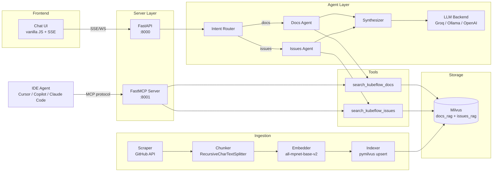

# Kubeflow Docs Agent POC

**Agentic RAG for Kubeflow Documentation** - a fully functional proof-of-concept demonstrating production-grade architecture for [GSoC 2026 Project 1: Agentic RAG on Kubeflow](https://www.kubeflow.org/events/gsoc-2026/).

Built by [Jay Guwalani](https://github.com/JayDS22) | [LinkedIn](https://linkedin.com/in/j-guwalani) | jguwalan@umd.edu

## Architecture



**Two interaction modes** per the [KEP-867 spec](https://docs.google.com/document/d/1RV2bfoZi8cVG0s1kmMNJ2sk6igAFzjJEROaltU21bWw/):

1. **Frontend Chat Mode** - web UI for documentation Q&A with streaming responses and citations
2. **Developer IDE Mode** - MCP server on `:8001` for Cursor/Copilot/Claude Code integration ("Thin Context" flow)

## Quick Start

### Prerequisites
- Docker and Docker Compose
- (Optional) [Groq API key](https://console.groq.com/) for LLM synthesis (free tier works)
- (Optional) GitHub token for higher scraping rate limits

### One-Command Setup

```bash
cp .env.example .env
# edit .env with your API keys

make up
```

This starts Milvus, the agent server, the frontend, and runs the ingestion pipeline. Takes ~3-5 minutes depending on network speed.

| Service  | URL                          |
|----------|------------------------------|
| Frontend | http://localhost:8080         |
| API      | http://localhost:8000         |
| MCP      | http://localhost:8001         |
| Health   | http://localhost:8000/health  |

### Kubernetes (Kind)

```bash
make deploy-kind
```

### Verify

```bash
# health check
curl http://localhost:8000/health
# {"status": "healthy", "milvus_connected": true, "model_loaded": true}

# ask a question
curl -X POST http://localhost:8000/chat \
  -H "Content-Type: application/json" \
  -d '{"query": "How do I install Kubeflow?", "stream": false}'

# run the demo script
bash scripts/demo.sh
```

## Bugs Fixed

This POC addresses three specific issues identified in the existing `kubeflow/docs-agent` codebase:

### Issue #181: Content Truncation Mismatch

**Problem:** The main server endpoints (`server/app.py`) truncate retrieved content to 400 characters before passing it to the LLM, while the MCP server (`mcp-server/server.py`) passes full content. This means the web chat gets degraded answers compared to IDE users.

**Fix:** Content truncation is now configurable via `CONTENT_MAX_CHARS` environment variable, defaulting to `0` (no truncation). Both the API and MCP paths use the same configurable limit.

```python
# agent/tools/docs_search.py
CONTENT_MAX_CHARS = int(os.getenv("CONTENT_MAX_CHARS", "0"))

# applied consistently in both tools
if CONTENT_MAX_CHARS > 0:
    content = content[:CONTENT_MAX_CHARS]
```

### Issue #182: Feast VARCHAR Monkey-Patch Fragility

**Problem:** The existing pipeline uses Feast as an intermediate abstraction over Milvus, requiring a monkey-patch (`feast.infra.online_stores.milvus_online_store.MILVUS_VARCHAR_MAX_LENGTH = 2000`) to work around Feast's default 256-char VARCHAR limit. This breaks silently on Feast version upgrades.

**Fix:** This POC uses `pymilvus.MilvusClient` directly, eliminating Feast entirely. The MilvusClient is thread-safe, lighter, and the `kagent-feast-mcp/mcp-server/server.py` already validates this pattern in production.

```python
# ingestion/indexer.py - direct pymilvus, no Feast
from pymilvus import MilvusClient
client = MilvusClient(uri=MILVUS_URI)
client.upsert(collection_name=name, data=batch)
```

### Issue #183: SentenceTransformer + Milvus Compound Initialization Cost

**Problem:** The embedding model and Milvus client are instantiated per-request in several code paths, adding ~3 seconds of overhead to every query (model loading + connection handshake).

**Fix:** Both are initialized as module-level singletons, loaded once on first access and reused across all subsequent requests.

```python
# agent/tools/base.py - singleton pattern
_model: SentenceTransformer | None = None

def get_model() -> SentenceTransformer:
    global _model
    if _model is None:
        _model = SentenceTransformer(EMBEDDING_MODEL)
    return _model
```

### Additional Fix: Idempotent Upsert vs Drop-and-Recreate

**Problem:** The current `store_milvus` KFP component drops the entire collection before reinserting. If the GitHub API rate-limits mid-ingestion, the collection is left empty and the agent returns zero results until the next successful full run.

**Fix:** This POC uses `upsert()` keyed on `file_unique_id` (`repo:path:chunk_idx`). Partial ingestion failures leave existing data intact.

## Project Structure

```
kubeflow-docs-agent-poc/
├── agent/                  # LangGraph agent pipeline
│   ├── graph.py            # StateGraph: router -> agent -> synthesizer
│   ├── router.py           # Keyword-based intent classifier
│   ├── state.py            # AgentState TypedDict
│   ├── config.py           # Centralized env var config
│   └── tools/
│       ├── base.py          # Singleton model + client (fixes #183)
│       ├── docs_search.py   # MCP tool: docs_rag search (fixes #181)
│       └── issues_search.py # MCP tool: issues_rag search
├── ingestion/              # KFP-style ingestion pipeline
│   ├── scraper.py           # GitHub API with backoff
│   ├── chunker.py           # Hugo-aware text splitter
│   ├── embedder.py          # Batched embedding with singleton model
│   ├── indexer.py           # pymilvus upsert (fixes #182)
│   └── pipeline.py          # Orchestrator
├── server/
│   ├── app.py               # FastAPI + SSE + WebSocket
│   └── mcp_server.py        # FastMCP for IDE integration
├── frontend/
│   ├── index.html           # Chat UI
│   └── style.css            # Dark theme
├── k8s/                    # Kubernetes manifests + Kustomize
├── eval/
│   ├── golden_dataset.json  # 20 Q&A pairs
│   └── evaluate.py          # Keyword recall, citation coverage, latency
├── tests/                  # Unit tests (pytest)
├── scripts/
│   ├── setup-kind.sh        # Kind cluster deployment
│   └── demo.sh              # Sample queries
├── docker-compose.yml       # One-command local stack
└── Makefile                 # make up, make test, make eval, make deploy-kind
```

## Design Decisions

1. **pymilvus direct over Feast** - Feast adds a monkey-patch dependency for VARCHAR limits and an unnecessary abstraction layer. pymilvus MilvusClient is thread-safe and lighter. The MCP server in `kagent-feast-mcp` already validates this pattern.

2. **Upsert over drop-and-recreate** - Idempotent writes keyed on `file_unique_id` prevent data loss during partial ingestion failures. The existing pipeline drops the collection first, which is destructive.

3. **Configurable content truncation** - Both server paths (API + MCP) use the same `CONTENT_MAX_CHARS` env var with a default of 0 (no truncation), eliminating the asymmetry between web and IDE users.

4. **Singleton initialization** - Model and Milvus client loaded once, reused globally. Eliminates ~3s overhead per query.

5. **Collection isolation** - Separate `docs_rag` and `issues_rag` collections rather than partitions. Each MCP tool maps 1:1 to a collection. Schemas can diverge independently as the project evolves.

6. **LangGraph over raw LangChain** - StateGraph enables explicit routing, self-correction loops (retry with broader query on empty retrieval), and clean separation between routing, retrieval, and synthesis stages.

## Evaluation

```bash
make eval
```

Runs 20 golden dataset queries and reports:
- **Keyword recall**: % of expected technical terms found in responses
- **Citation coverage**: % of responses with valid kubeflow.org citation URLs
- **Avg latency**: mean response time (target: <5s on warm pod)
- **Results**: saved to `eval/results/` as timestamped JSON

## Testing

```bash
make test
```

Runs unit tests for the router, MCP tools, and ingestion chunker. Tests use mocked Milvus and embedding model (no external dependencies needed).

## Production Upgrades

What would change for a real deployment on the Kubeflow platform:

| Component | POC | Production |
|-----------|-----|------------|
| LLM | Groq free tier API | Self-hosted vLLM on KServe with scale-to-zero |
| Agent lifecycle | Docker container | Kagent CRDs for declarative agent management |
| Infrastructure | Docker Compose / Kind | Terraform on OCI/GCP with Helm charts |
| Service mesh | None | Istio mTLS between agent, tools, and vector DB |
| Autoscaling | Fixed replicas | KEDA ScaledObject with HTTP add-on |
| Guardrails | None | Llama-Guard via KServe for content safety |
| Feedback | None | Thumbs up/down webhook feeding golden dataset pipeline |
| Tuning | Static config | Katib for RAG hyperparameter optimization |
| Router | Keyword heuristics | LLM-based classifier with confidence thresholds |
| Ingestion | One-shot script | Scheduled KFP pipeline with incremental updates |
| Observability | Logging | OpenTelemetry spans + Prometheus metrics |

## References

- [GSoC 2026 Spec: Agentic RAG on Kubeflow](https://www.kubeflow.org/events/gsoc-2026/)
- [KEP-867: Docs Agent Reference Architecture](https://docs.google.com/document/d/1RV2bfoZi8cVG0s1kmMNJ2sk6igAFzjJEROaltU21bWw/)
- [Docs Agent V2 Vision Doc](https://github.com/kubeflow/docs-agent) (Chase Christensen)
- [Optimizing RAG Pipelines with Katib](https://blog.kubeflow.org/katib/rag/)

## License

Apache 2.0 (consistent with Kubeflow project licensing)
