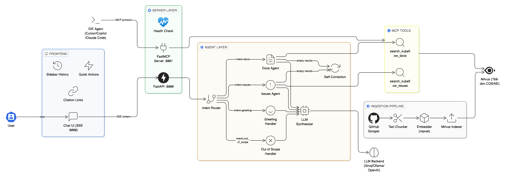

# Kubeflow Docs Agent POC

**Agentic RAG for Kubeflow Documentation** - a fully functional proof-of-concept demonstrating production-grade architecture for [GSoC 2026 Project 1: Agentic RAG on Kubeflow](https://www.kubeflow.org/events/gsoc-2026/).

Built by [Jay Guwalani](https://github.com/JayDS22) | [LinkedIn](https://linkedin.com/in/j-guwalani) | jguwalan@umd.edu

## Architecture

<!-- Replace with eraser.io diagram image URL -->


**Two interaction modes** per the [KEP-867 spec](https://docs.google.com/document/d/1RV2bfoZi8cVG0s1kmMNJ2sk6igAFzjJEROaltU21bWw/):

1. **Frontend Chat Mode** - web UI with sidebar chat history, SSE streaming, quick-action buttons, and citation links
2. **Developer IDE Mode** - MCP server on `:8001` for Cursor/Copilot/Claude Code integration ("Thin Context" flow)

**Data flow:**

```
User Query -> FastAPI (:8000) -> LangGraph StateGraph
  -> Intent Router (docs | issues | greeting | out_of_scope)
  -> [Docs Agent | Issues Agent] -> MCP Tool -> Milvus (COSINE ANN search)
  -> Self-correction (retry with broader query if empty results)
  -> LLM Synthesizer (Groq / Ollama / OpenAI) -> SSE streamed response + citations
```

## Demo Screenshots

| Chat UI with Citations | Sidebar History | Health Check |
|------------------------|-----------------|--------------|
|  |  |  |

## Quick Start

### Prerequisites
- Docker and Docker Compose (8GB+ RAM allocated)
- (Optional) [Groq API key](https://console.groq.com/) for LLM synthesis (free tier)
- (Optional) GitHub token for higher scraping rate limits (5000 req/hr vs 60)

### One-Command Setup

```bash
cp .env.example .env
# edit .env with your API keys

make up
```

Starts Milvus (etcd + MinIO + standalone), the agent server, the frontend, and runs the ingestion pipeline. Scrapes 273 docs from `kubeflow/website`, produces 2030 chunks, embeds with `all-mpnet-base-v2`, and indexes into Milvus via idempotent upsert. Takes ~10 minutes on first run (model download + embedding on CPU).

| Service  | URL                          |
|----------|------------------------------|
| Frontend | http://localhost:8080         |
| API      | http://localhost:8000         |
| MCP      | http://localhost:8001         |
| Health   | http://localhost:8000/health  |

### Kubernetes (Kind)

```bash
make deploy-kind
```

### Verify

```bash
# health check
curl http://localhost:8000/health
# {"status": "healthy", "milvus_connected": true, "model_loaded": true}

# docs query with citations
curl -s -X POST http://localhost:8000/chat \
  -H "Content-Type: application/json" \
  -d '{"query": "How do I install Kubeflow?", "stream": false}' | python3 -m json.tool

# greeting (no tool calls)
curl -s -X POST http://localhost:8000/chat \
  -H "Content-Type: application/json" \
  -d '{"query": "Hello", "stream": false}' | python3 -m json.tool

# run full demo
bash scripts/demo.sh
```

## Bugs Fixed

This POC addresses three specific issues in the existing `kubeflow/docs-agent` codebase, plus one architectural fix:

### Issue #181: Content Truncation Mismatch

**Problem:** Main server truncates retrieved content to 400 chars before passing to the LLM. MCP server passes full content. Web users get degraded answers compared to IDE users.

**Fix:** Truncation is configurable via `CONTENT_MAX_CHARS` env var, defaulting to `0` (disabled). Both API and MCP paths use the same limit.

### Issue #182: Feast VARCHAR Monkey-Patch Fragility

**Problem:** Pipeline uses Feast over Milvus, requiring `MILVUS_VARCHAR_MAX_LENGTH = 2000` monkey-patch. Breaks silently on Feast upgrades.

**Fix:** Uses `pymilvus.MilvusClient` directly. No Feast dependency. Thread-safe, lighter, validated by the `kagent-feast-mcp/mcp-server/server.py` pattern.

### Issue #183: SentenceTransformer + Milvus Compound Initialization Cost

**Problem:** Model and client instantiated per-request in several paths. Adds ~3s overhead per query.

**Fix:** Module-level singletons loaded once on first access, reused globally.

### Additional: Idempotent Upsert vs Drop-and-Recreate

**Problem:** `store_milvus` KFP component drops the entire collection before reinserting. Rate-limit mid-ingestion leaves the collection empty.

**Fix:** `upsert()` keyed on `file_unique_id` (`repo:path:chunk_idx`). Partial failures leave existing data intact. Primary key is `file_unique_id` (VARCHAR), not auto-generated INT64, which is required for Milvus upsert support.

## Project Structure

```
kubeflow-docs-agent-poc/
├── agent/                     # LangGraph agent pipeline
│   ├── graph.py               # StateGraph: router -> agent -> synthesizer
│   ├── router.py              # Intent classifier with error-signal boosting
│   ├── state.py               # AgentState TypedDict
│   ├── config.py              # Centralized env var config
│   └── tools/
│       ├── base.py            # Singleton model + client (fixes #183)
│       ├── docs_search.py     # MCP tool: docs_rag search (fixes #181)
│       └── issues_search.py   # MCP tool: issues_rag search
├── ingestion/                 # Ingestion pipeline (scrape -> chunk -> embed -> index)
│   ├── scraper.py             # GitHub API with exponential backoff
│   ├── chunker.py             # Hugo frontmatter stripping + RecursiveCharTextSplitter
│   ├── embedder.py            # Batched embedding with singleton model
│   ├── indexer.py             # pymilvus upsert, Zilliz Cloud compatible (fixes #182)
│   └── pipeline.py            # Stage orchestrator with timing
├── server/
│   ├── app.py                 # FastAPI: SSE streaming + WebSocket + health check
│   └── mcp_server.py          # FastMCP server for IDE integration
├── frontend/
│   └── index.html             # Chat UI: sidebar history, quick actions, citations
├── k8s/                       # Kubernetes manifests + Kustomize
│   ├── namespace.yaml
│   ├── milvus-standalone.yaml # Resource-constrained for local Kind
│   ├── agent-deployment.yaml
│   ├── agent-service.yaml
│   ├── frontend-deployment.yaml
│   ├── ingress.yaml
│   └── kustomization.yaml
├── eval/
│   ├── golden_dataset.json    # 20 Q&A pairs across 10 Kubeflow topics
│   └── evaluate.py            # Keyword recall, citation coverage, latency
├── tests/                     # 35 unit tests (pytest)
│   ├── test_router.py         # 15 intent classification tests
│   ├── test_tools.py          # 6 MCP tool tests (schema, truncation, errors)
│   ├── test_ingestion.py      # 11 chunker + citation URL builder tests
│   └── conftest.py            # Mocked Milvus + embedding model fixtures
├── scripts/
│   ├── setup-kind.sh          # Kind cluster deployment
│   └── demo.sh                # Sample queries against running stack
├── docker-compose.yml         # One-command local stack (Milvus + Server + Frontend)
├── Makefile                   # make up | down | test | eval | deploy-kind | clean
└── .env.example               # Template for API keys
```

## Key Design Decisions

1. **pymilvus direct over Feast** - Eliminates the VARCHAR monkey-patch dependency and unnecessary abstraction layer. The MCP server in `kagent-feast-mcp` already validates this pattern.

2. **Upsert over drop-and-recreate** - `file_unique_id` as VARCHAR primary key enables idempotent writes. Milvus requires user-managed PKs for upsert (auto_id must be off).

3. **Configurable content truncation** - `CONTENT_MAX_CHARS=0` by default (no truncation). Eliminates the asymmetry between API and MCP paths.

4. **Singleton initialization** - Model and client loaded once, reused globally. Single "Model loaded" log line on startup confirms this.

5. **Collection isolation** - Separate `docs_rag` and `issues_rag` collections. Each MCP tool maps 1:1 to a collection. Schemas can diverge independently.

6. **LangGraph StateGraph** - Explicit routing with conditional edges, self-correction loops (retry with broader query on empty retrieval), clean separation between routing, retrieval, and synthesis.

7. **Error-signal boosting in router** - When error-related keywords (crash, debug, traceback, etc.) appear alongside docs keywords (pipeline, kubeflow), the router boosts the issues score by +2 to break ties correctly.

8. **Zilliz Cloud compatibility** - Indexer handles both local Milvus and Zilliz Cloud serverless. Auto-index and auto-load are wrapped in try/except since Zilliz manages these internally.

## Testing

```bash
# activate venv first
source venv/bin/activate

# run all 35 tests
python -m pytest tests/ -v --tb=short
```

```
tests/test_ingestion.py   11 passed   (content cleaning, citation URL builder)
tests/test_router.py      15 passed   (docs, issues, greeting, out_of_scope)
tests/test_tools.py        6 passed   (schema, no-truncation, empty results, errors)
                          ──────────
                          35 passed, 0 failed
```

Tests use mocked Milvus and embedding model via `conftest.py` fixtures. No running infrastructure needed.

## Evaluation

```bash
python eval/evaluate.py
```

Runs 20 golden dataset queries against the live agent and reports:
- **Keyword recall**: % of expected technical terms in responses
- **Citation coverage**: % of responses with valid kubeflow.org URLs
- **Avg latency**: mean response time (target: <5s warm pod)
- **Results**: saved to `eval/results/` as timestamped JSON

## Frontend Features

- Kubeflow hexagonal logo with gradient branding
- Sidebar with persistent chat history (localStorage)
- New Chat button to start fresh conversations
- Click any history item to reload full conversation with citations
- Delete conversations with hover trash icon
- Quick-action buttons (Install Kubeflow, KServe, Pipelines, Katib)
- SSE streaming with animated typing indicator
- Status badge (Online / Degraded / Offline) with health polling
- Mobile responsive with hamburger menu for sidebar
- DM Sans + JetBrains Mono typography
- Glassmorphism with backdrop-filter blur

## Production Upgrades

What would change for a real deployment on the Kubeflow platform:

| Component | POC | Production |
|-----------|-----|------------|
| LLM | Groq free tier API | Self-hosted vLLM on KServe with scale-to-zero |
| Agent lifecycle | Docker container | Kagent CRDs for declarative agent management |
| Infrastructure | Docker Compose / Kind | Terraform on OCI/GCP with Helm charts |
| Service mesh | None | Istio mTLS between agent, tools, and vector DB |
| Autoscaling | Fixed replicas | KEDA ScaledObject with HTTP add-on |
| Guardrails | None | Llama-Guard via KServe for content safety |
| Feedback | None | Thumbs up/down webhook feeding golden dataset pipeline |
| Tuning | Static config | Katib for RAG hyperparameter optimization |
| Router | Keyword heuristics with error boosting | LLM-based classifier with confidence thresholds |
| Ingestion | One-shot script | Scheduled KFP pipeline with incremental updates |
| Observability | Logging | OpenTelemetry spans + Prometheus metrics |
| Vector DB | Local Milvus / Zilliz Cloud | Managed Milvus on K8s with persistent volumes |

## References

- [GSoC 2026 Spec: Agentic RAG on Kubeflow](https://www.kubeflow.org/events/gsoc-2026/)
- [KEP-867: Docs Agent Reference Architecture](https://docs.google.com/document/d/1RV2bfoZi8cVG0s1kmMNJ2sk6igAFzjJEROaltU21bWw/)
- [Docs Agent V2 Vision Doc](https://github.com/kubeflow/docs-agent) (Chase Christensen)
- [Optimizing RAG Pipelines with Katib](https://blog.kubeflow.org/katib/rag/)

## License

Apache 2.0 (consistent with Kubeflow project licensing)